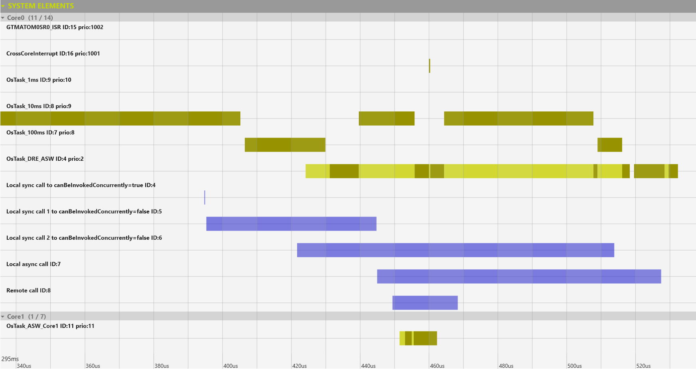
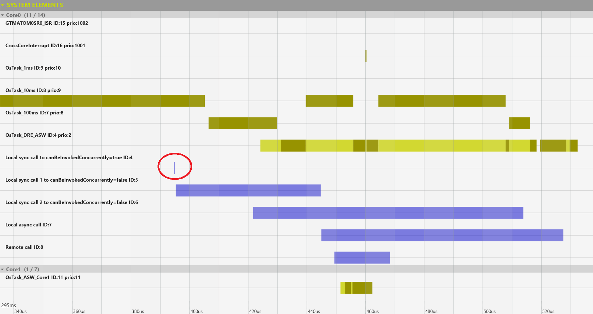
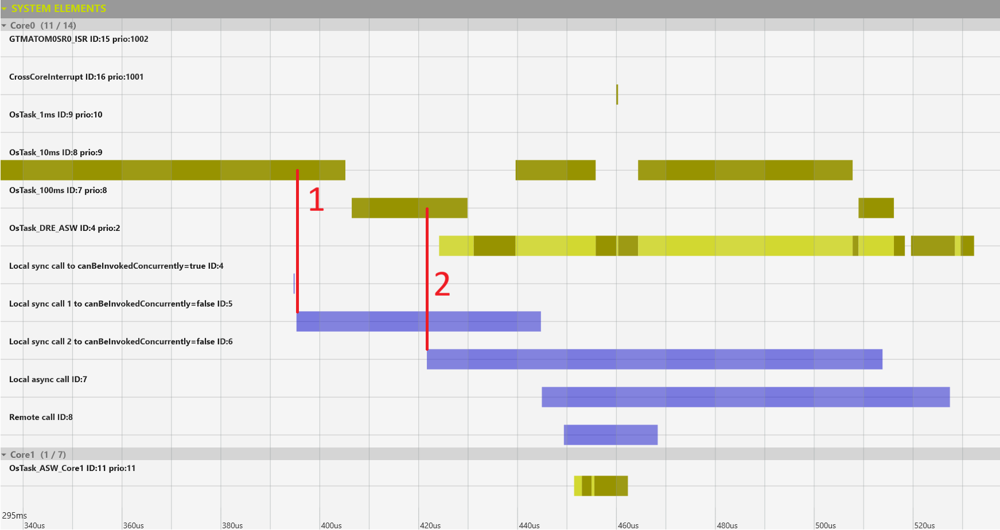
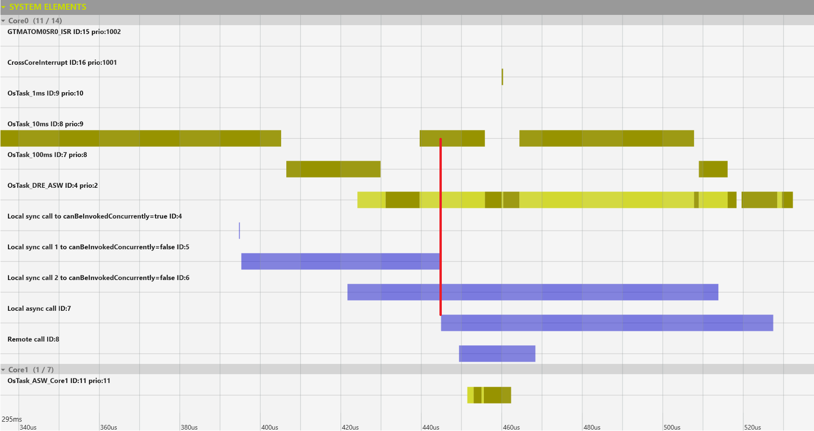

# Calling Client/Server operations

## Introduction

Client/server (C/S) operations are the fundemantal way to enable applications to call other component's functionality as well
as passing information. They are a powerful method to create a clean software architecture but it does come with its own
pitfalls.
A C/S operation consists of a server, providing the operation and one to many clients, invoking the provided operation(s).

---

### RTE as the C/S facilitator
C/S operations, in their simplest forms, can be thought of as simple C functions calls. The client is calling a function
of the server to get the desired functionality. In an AUTOSAR system, the RTE has to take care of all other non-trivial
situations: what if there is more than one client, what if the function is not reentrant or the client wants to call
the function asynchronously?

--- 

## The problem
Although the RTE can and will resolve all concurency issues with syncrhonous calls, will take care of asynchronous calls,
it will do so to the expense of efficency. In certain cases it can even introduce a form of priority inversion, which 
we will see in the case study.

### The setup
The case study will use a C/S interface with a single operation: `IncrementValue(uint8 inputValue, uint8* outputValue)`.

The operation takes the input parameter, increments it by one and returns it in the output parameter.

We will analyze the timing and behavior when called in four different scenarios:

- syncrhonous call of operation marked as reentrant
- synchronous call of operation marked as non-reentrant, call by two clients
- asynchronous call
- remote call: operation called from core 0, executing on core 1

The calls are triggered from the same OsTask_10ms task, the second client is calling from OsTask_100ms. The bevior of
the software is summarized in the below chart.

<figure>
  
  <figcaption>Task, ISR and runnable behavior</figcaption>
</figure>

### Synchronous call of operation marked as reentrant
This scenario generates a direct function call, the relevant property of the runnable is "canBeInvokedConcurrently" which
needs to be set to TRUE. The execution of the operation is extremely fast, 184 ns on average.

<figure>
  
  <figcaption>Synchronous call of reentrant operation</figcaption>
</figure>

### Synchronous call of non-reentrant operation called by two clients

Client 1 is calling from the context of OsTask_10ms, while client 2 calls from the lower priority OsTask_100ms. 
Call #1 finishes in approximately 49 us and call #2 in around 92 us. 

The first observation we have to make is that both are orders of magnitude larger than the simple C function call. 
Such calls, when executed frequently, can add significant
CPU load which most of the time can be avoided.

The second issue is the priority inversion mentioned earlier. As there are two clients in different preemption areas,
the server runnable has to be mapped to a task, in this case, OsTask_DRE_ASW. The server runnable runs in a lower priority
than both clients. This creates the priority inversion: OsTask_100ms has to finish / yield before OsTask_DRE_ASW runs,
effectively blocking OsTask_10ms, which is of higher priority.

Finally, there is an inconsistency of actual response time, the second client waits almost twice as much than the first,
although the executed operation is the same. This is because OsTask_10ms resumes execution, delaying the execution of 
OsTask_DRE_ASW.

<figure>
  
  <figcaption>Two clients calling a non-reentrant server runnable</figcaption>
</figure>

### Asynchronous call

The asynchronous call is made in the contex of OsTask_10ms and it takes about 82 us to finish. As the server runnable
is mapped to the same OsTask_DRE_ASW, we have another example of priority inversion: servicing the asynchronous call must
wait for the servicing of the previous syncrhonous non-reentrant call.

<figure>
  
  <figcaption>Asynchronous call</figcaption>
</figure>

### Remote call

The remote call is initiated right after the asynchronius call in the context of OsTask_10ms and it takes about 19 us to
finish. This is a synchronous call, the client waits until the server returns, even if running on another core. The server
runnable is mapped to the task OsTask_ASW_Core1, cross-core calls have to be mapped to be able to execute them. As the
cross-core call is not impeded by any other event servicing, it finishes significantly faster than the asynchronous call
launched before, executing on the same core.

<figure>
  
  <figcaption>Remote call</figcaption>
</figure>

---

## Optimization

Optimization strategies should focus on achieving direct function calls as the clien-server communication implementation.

### Mark runnables as reentrant

The important runnable property is called `canBeInvokedConcurrently`. The AUTOSAR standard specifies this as an optional
parameter, RTE generators can and will generate code, with the propert not set to any value and it assumes being FALSE.
A common mistake is to design and implement the C code as reentrant but failing to explicitly mark it with 
`canBeInvokedConcurrently`.

### Reimplement runnables to be reentrant
Some runnables might have `canBeInvokedConcurrently` set to TRUE as the underlying runnable was not desigend to be 
reentrant. If the effort is not prohibitive, one should always try to write reentrant runnables for servicing C/S operations.

### Map clients to the same preemption area
Even if the runnable is non-reentrant, it can still be guaranteed that there are no reentrancy issues if all clients
execute in the same preemption area. This can mean the same task, or tasks with the same priority for the client runnables.
Once all clients are verified to be in the same preemption area, the RTE can emit simple C function calls for these.

### Avoid cross-core C/S calls
If possible, minimize or eliminate calls between cores. These are always implemented via events adding to the latency of
the call.

### AUTOSAR BSWs
Most, but not all, AUTOSAR BSW services are designed to be reentrant. Optimization should focus on accessing BSW services
from one core only, as these will convert to simple C functions calls.

---

## Results

The values presented in the case-study speak for themselves. The response time is impacted by both the event handling
mechanism (extra code, 20 to 25us) as well as the relative priority of the server runnable (40us but potentially 
milliseconds).
One C/S call every 5ms, with an extra overhead of 20us generates 0.4% CPU load. Ten such calls are already generating 
4% extra CPU load.

## How-to

1. Identify all C/S relations between applications and BSW.
2. Verify if the runnable design (`canBeInvokedConcurrently`) matches the runnable implementation.
3. If possible, reimplement and mark the runnable as reentrant.
4. Redeploy application components so cross-core C/S calls are minimized or completely eliminated.
5. Redeploy application components so BSW services are mainly accessed on the same core.
