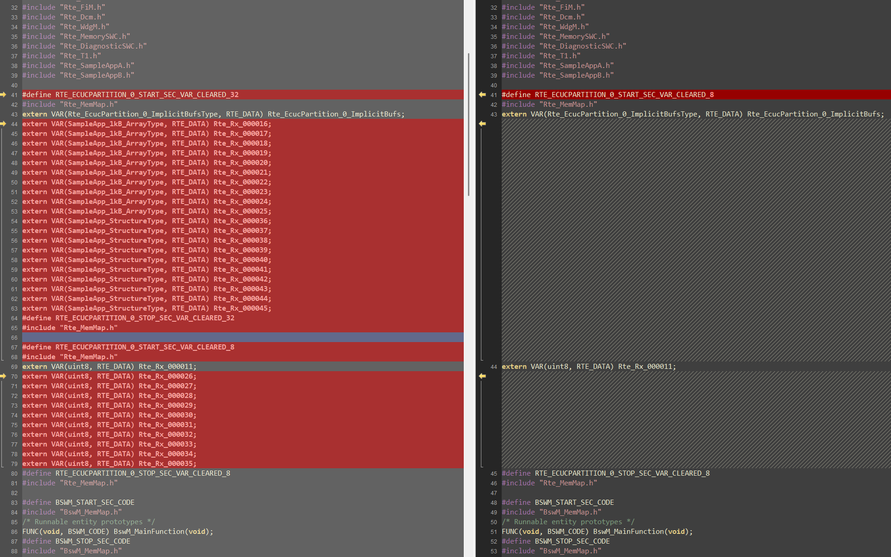
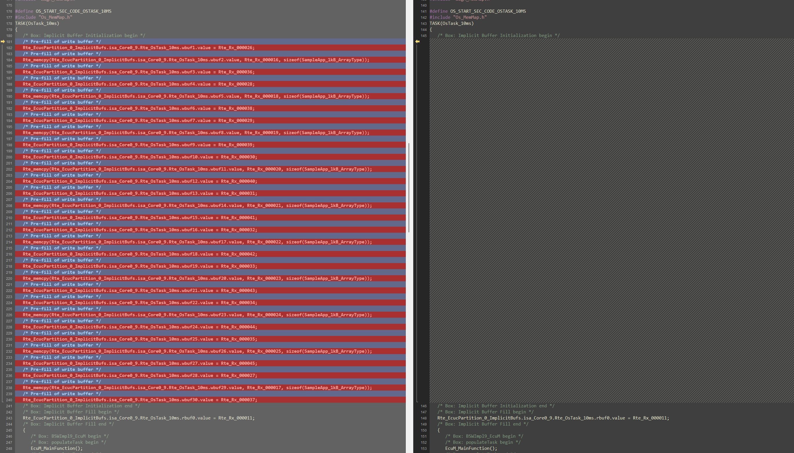
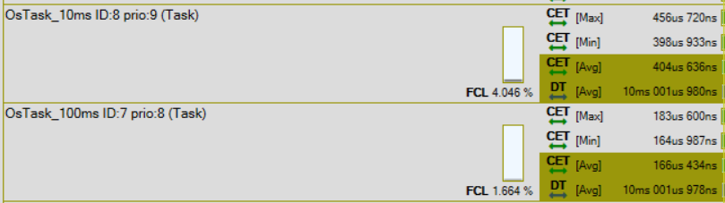
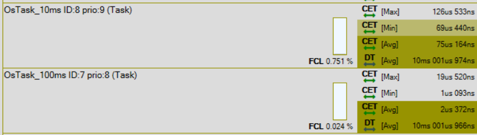

# RTE implicit communication

## Introduction

AUTOSAR application software components communicate via ports to interact with other components:

- data exchange via ports typed by `SenderReceiverInterface`, `NvDataInterface`
- sharing services via ports typed by `ClientServerInterface`

Implicit/explicit communication refers to data exchange interfaces: how data is passed through the port wrt. to the
runnables accesing them. The type of communication is configured in the internal behavior of the SWC, more precisely,
it is an attribute of a `RunnableEntity`.
RunnablEntities can aggregate an arbitrary number of VariableAccess attributes. The type of VariableAcces will dictate
the type of communication:

- implicit communication: `dataReadAccess` and `dataWriteAccess`
- explicit communication: `dataReceivePoint` and `dataSendPoint`

!!! tip "Formal definition"
    We say that implicit read access means a VariableAccess aggregated in the role of `dataReadAccess` for that runnable.

    Similarly, implicit write access means a VariableAccess aggregated in the role of `dataWriteAccess`.

---

### Behavior of implicit read/write access
Implicit read access semantics means that the data accessed (read) by a runnable entity must not change during the 
lifetime of the runnable entity. 

Implicit write access semantics means that the data written by a runnable entity is only visible to other runnable 
entities after the accessing runnable entity has terminated. 

In order to achieve this behavior, the concept of **copy semantics** is introduced: the accessing entities are able to
read or write the copied data from their execution context in a non concurrent and non preempting manner.
!!! tip "However..."
     If all accessing entities are in the same preemption area this might not require
    a real physical data copy.  
This small but important detail is what we are going to exploit.

--- 

## The problem
Creating physical local copies of variables has two disadvantages: 

- **RAM consumption:** Every copy is the size of the port interface which can grow fast with both the port interface size
and the number of ports accessed.
- **Flash consumption:** the code copying the data consumes code space.
- **Runtime:** The local copies have to be initialized either via direct assignment or by calling copy functions (for larger 
data).

---

## Optimization
The solution consist in exploiting the already mentioned property of copy semantics: we bring the accessing entities
into the same preemption area. This can be achieved by moving the runnables to the same task or creating a task group
with all the tasks which contain the accessing runnables. The following example employs the latter.

---

## Results
Our sample project contains two application SWCs (A and B), each with one runnable. The runnables have 30
dataRead/WriteAccess elements to access the dataElements of 30 ports. The are only 3 port interfaces used, each one is
instantied through 10 ports. The data is the only significant aspects which varies: 10x 1024byte, 10x 64byte and 10x1byte
interfaces. 

### The code
Upon comparing the before/after scenario, significant parts of code disappear after the optimization. This is a tell tale
sign that the optimization is working as intended.

<figure>
  
  <figcaption>Multiple global variables disappear</figcaption>
</figure>
<figure>
  
  <figcaption>Copy routines no longer needed</figcaption>
</figure>

### Memory consumption
Analyzing the map file, we can observe that a large structures is gone: `Rte_EcucPartition_0_ImplicitBufs` of ~21.5kB.

We saved over 21kB of RAM through the optimization. This number can be verified with simple math: the total data size 
of all 30 ports is 10890 bytes and we need 2 local copies for the two different tasks scheduling the runnables.

### Runtime
The before/after runtime of the tasks was measured via T1.cont focus measurements. The results speak for themselves: we
achieved an almost 5% CPU load reduction on the core.

<figure>
  
  <figcaption>Task timing for inefficient configuration</figcaption>
</figure>
<figure>
  
  <figcaption>Task timing for optimized configuration</figcaption>
</figure>

## How-to

1. Identify your application runnables with implicit data access. The easiest method is to check the internal behavior of
the software component(s).
2. Identify the task(s) which schedule the runnables.
3. Remap the events triggering the runnables to the same task OR
4. Create an internal resource in the OS configuration and reference it from the tasks scheduling the runnables.
5. Make sure the option "--implicit-use-global-buffers" is set to "2" for the RTA-RTE generation.
6. Regenerate RTE and OS.
7. Validate the before/after timing results.
